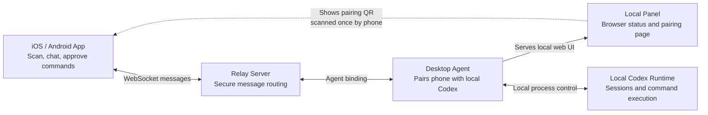
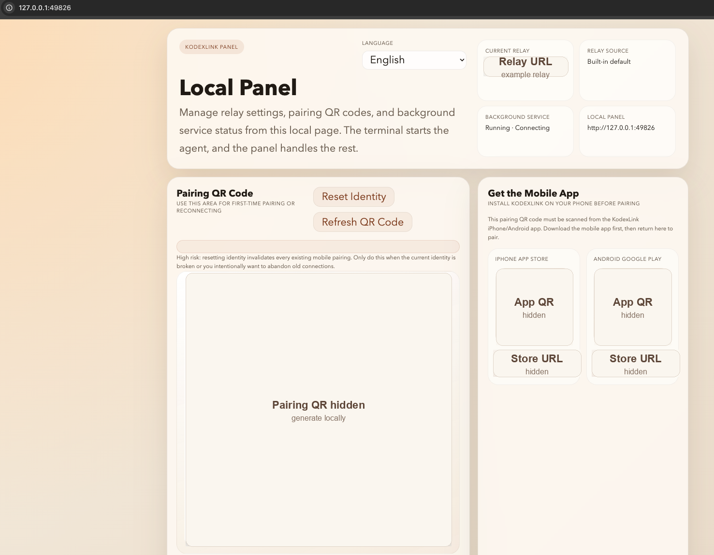
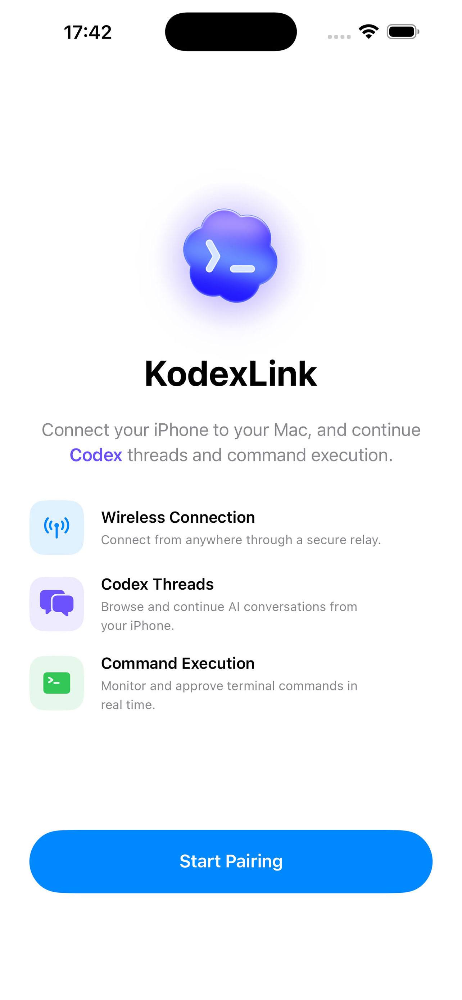
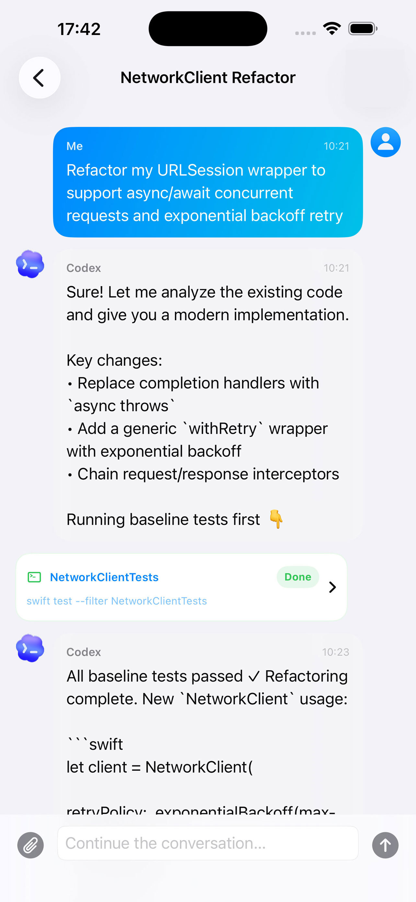
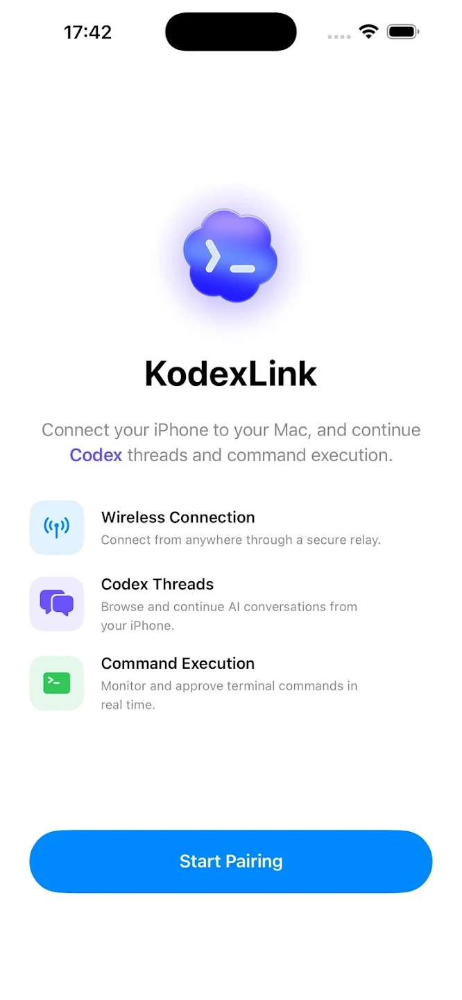
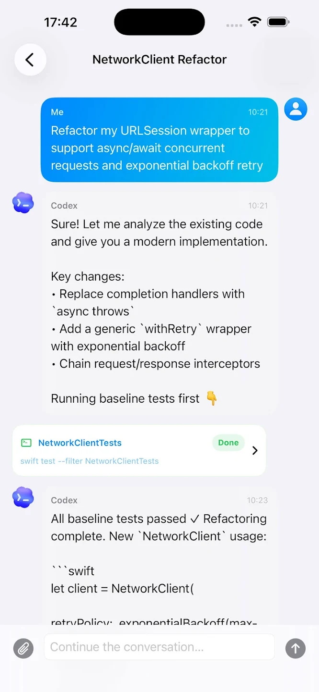

# KodexLink

KodexLink is a mobile companion for local Codex workflows. It lets you pair an iPhone or Android app with a desktop agent, continue Codex threads from your phone, monitor command execution, and approve terminal actions while the actual Codex runtime stays on your Mac.

The desktop agent starts a local browser panel for pairing and status, connects to the relay server for message routing, and bridges approved mobile actions back to the local Codex process.

## Mobile App

KodexLink pairing requires the mobile companion app:

- [iPhone app on the App Store](https://apps.apple.com/us/app/kodexlink-codex-mobile-chat/id6761055159?uo=4)
- [Android app on Google Play](https://play.google.com/store/apps/details?id=com.kodexlink.android)

## How It Works

## App Preview

### Desktop Local Panel

  

### iOS

  
  

### Android

  
  

## Repository Structure

This repository is organized into a few major areas:

- `runtime-apps/desktop-agent/`
  The desktop CLI product published as `kodexlink`. It starts the local panel, manages pairing, and bridges the local Codex runtime to the relay.
- `runtime-apps/relay-server/`
  The relay backend. It handles authentication, pairing, bindings, routing, thread operations, turn flow, approvals, and presence.
- `runtime-apps/fake-agent/`
  A lightweight simulated agent used for local protocol debugging and end-to-end testing without the real desktop runtime.
- `runtime-apps/load-mobile/`
  A multi-client load and smoke test tool that simulates many mobile clients against a relay.
- `packages/protocol/`
  Shared wire message definitions used across clients, agents, and the relay.
- `packages/schemas/`
  Shared schemas and config validation.
- `packages/shared/`
  Shared utilities, logging helpers, IDs, timing helpers, and common runtime code.
- `ios/`
  The iOS KodexLink app.
- `android/`
  The Android KodexLink app.
- `scripts/`
  Development, deployment, health-check, and operational helper scripts.

Inside `runtime-apps/`, each subdirectory is a runnable application with a focused responsibility:

- `desktop-agent`: the desktop-facing product
- `relay-server`: the backend relay service
- `fake-agent`: a simulated development agent
- `load-mobile`: a relay load and regression client
