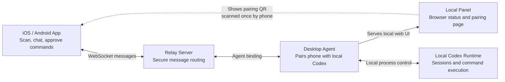

# KodexLink

KodexLink lets you use your phone as a companion screen for Codex running on your desktop computer. It is built for people who want to keep local Codex sessions on the desktop, but still follow the conversation, continue a thread, and approve terminal actions from an iPhone or Android device.

## Why It Exists

Codex workflows often live in a terminal on one machine. That works well when you are sitting at the computer, but it is awkward when you want to step away, check a long-running task, reply to a thread, or approve a command without returning to the keyboard.

KodexLink adds a mobile layer around that local workflow. The desktop agent stays close to the Codex runtime, the relay routes messages between devices, and the mobile app gives you a focused interface for chat, thread history, command progress, and approvals.

## What You Can Use It For

- Continue Codex conversations from your phone while the actual runtime stays on your desktop computer.
- Watch command execution and task progress without keeping the terminal in front of you.
- Approve or reject terminal actions from the mobile app.
- Pair a phone with a desktop agent using a QR code from the local browser panel.
- Run with the default relay or host your own relay server from this repository.

## Basic Flow

1. Install the desktop CLI and start it:

   ```bash
   npm install -g kodexlink
   kodexlink start
   ```

2. Open the Local Panel URL printed by the agent. The panel shows service status and a pairing QR code.
3. Install the iOS or Android app, then scan the pairing QR code.
4. Use the mobile app to view Codex threads, send follow-up messages, monitor command output, and approve actions.

The Local Panel is not the mobile client. It is a local browser page served by the desktop agent for setup, pairing, relay status, and service controls.

## Mobile App

KodexLink pairing requires the mobile companion app:

- [iPhone app on the App Store](https://apps.apple.com/us/app/kodexlink-codex-mobile-chat/id6761055159?uo=4)
- [Android app on Google Play](https://play.google.com/store/apps/details?id=com.kodexlink.android)

## Self-Hosting Relay Server

By default, KodexLink uses the built-in relay. If you prefer to host your own for full control over your message routing:

### 1. Deploy the Server
The recommended production target is an **Ubuntu server** with a public domain and SSL certificates.

1. **Run the automated setup script** from the repository root:
   ```bash
   sudo bash scripts/setup-ubuntu-relay-host.sh \
     --domain relay.your-domain.com \
     --ssl-cert-path /path/to/fullchain.pem \
     --ssl-key-path /path/to/privkey.pem
   ```
2. **Build and start the service**:
   ```bash
   pnpm install
   pnpm build
   pnpm relay-server:migrate
   pnpm relay-server:start
   ```
For detailed requirements and manual installation steps, see the [Relay Deployment Guide](runtime-apps/relay-server/DEPLOYMENT.md).

### 2. Connect Your Desktop Agent
Once your relay is running, point your desktop agent to it. You only need to provide the relay URL once (via CLI or environment variable); the agent will persist the setting for future sessions.

**Via CLI flag:**
```bash
kodexlink start --relay https://relay.your-domain.com
```
**Via environment variable:**
```bash
KODEXLINK_RELAY_URL=https://relay.your-domain.com kodexlink start
```

### 3. Mobile App Configuration
The mobile apps are designed to be **zero-config**:
- **Automatic (Recommended)**: When you scan the pairing QR code from your desktop agent, the app automatically detects and connects to your self-hosted relay. No manual configuration is required on the phone.
- **Manual (Optional)**: If you need to enforce a specific relay, go to **Settings > Relay Environment** in the mobile app and enter your custom URL.

## How It Works



## App Preview

### Desktop Local Panel

<p>
  
</p>

### iOS

<p>
  
  
</p>

### Android

<p>
  
  
</p>

## Repository Structure

This repository is organized into a few major areas:

- `runtime-apps/desktop-agent/`
  The desktop CLI product published as `kodexlink`. It starts the local panel, manages pairing, and bridges the local Codex runtime to the relay.
- `runtime-apps/relay-server/`
  The relay backend. It handles authentication, pairing, bindings, routing, thread operations, turn flow, approvals, and presence.
- `runtime-apps/fake-agent/`
  A lightweight simulated agent used for local protocol debugging and end-to-end testing without the real desktop runtime.
- `runtime-apps/load-mobile/`
  A multi-client load and smoke test tool that simulates many mobile clients against a relay.
- `packages/protocol/`
  Shared wire message definitions used across clients, agents, and the relay.
- `packages/schemas/`
  Shared schemas and config validation.
- `packages/shared/`
  Shared utilities, logging helpers, IDs, timing helpers, and common runtime code.
- `ios/`
  The iOS KodexLink app.
- `android/`
  The Android KodexLink app.
- `scripts/`
  Development, deployment, health-check, and operational helper scripts.

Inside `runtime-apps/`, each subdirectory is a runnable application with a focused responsibility:

- `desktop-agent`: the desktop-facing product
- `relay-server`: the backend relay service
- `fake-agent`: a simulated development agent
- `load-mobile`: a relay load and regression client

## License
AGPL-3.0
